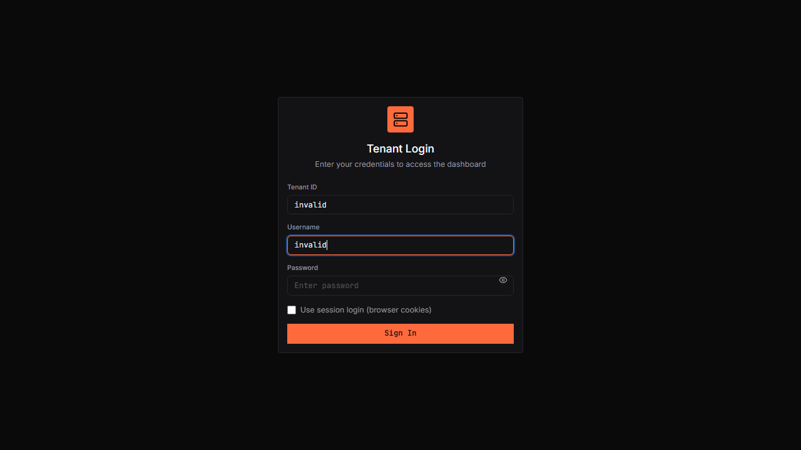
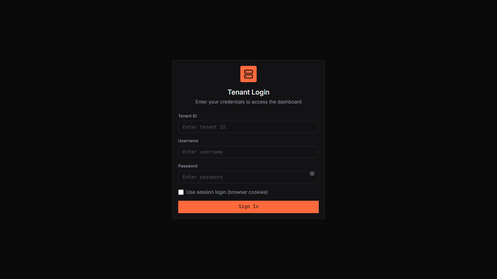

# IMS Hub UI

Modern React UI for IMS (Inventory Management System) - Vending Machine Management Platform.

## Quick Start

```bash
cd ims_ui
npm install
npm run dev        # http://localhost:3000
npm run build      # Production build
npm run test       # Playwright e2e tests
```

## Tech Stack

- **Framework**: React 18 + TypeScript + Vite
- **Styling**: Tailwind CSS (dark theme)
- **Components**: shadcn/ui (Radix UI primitives)
- **Data**: TanStack Query + Axios
- **Routing**: React Router v6
- **State**: Zustand

## Screenshots

| Page | Screenshot |
|------|------------|
| Tenant Login |  |
| Dashboard |  |
| Statistics |  |
| Quick Actions |  |
| Sidebar |  |

Full documentation: [docs/UI_DOCUMENTATION.md](docs/UI_DOCUMENTATION.md)

## Features

- **Dark Theme**: High contrast, minimal chrome
- **Monospace Data**: JetBrains Mono for all code/data
- **Stat Callouts**: Big numbers with small captions
- **Code Blocks**: Syntax highlighted with copy buttons
- **Pagination**: 20 items/page, configurable
- **Responsive**: Mobile, tablet, desktop
- **Accessible**: ARIA landmarks, focus states, keyboard nav

## Architecture

```
src/
├── components/
│   ├── ui/           # Reusable UI primitives
│   └── layout/       # Layout components
├── pages/
│   ├── *.tsx         # Tenant pages
│   └── admin/        # Admin pages
├── context/          # React context (Auth)
├── hooks/            # Custom hooks
├── lib/              # API client, utilities
└── e2e/              # Playwright tests
```

## API Endpoints (Proxied)

Base: `http://localhost:8000/api/v1`

| Endpoint | Description |
|----------|-------------|
| `/auth/token/pair` | JWT login |
| `/auth/login` | Session login |
| `/core/tenants` | Tenant management |
| `/core/tenant/users` | User management |
| `/core/tenant/devices/status` | Device status |
| `/core/tenant/reports/sales` | Sales reports |
| `/core/transaction/insert` | Transaction insert |

## Testing

```bash
npm run test          # All e2e tests
npm run test:ui       # Playwright UI
npm run test:headed   # Headed mode
```